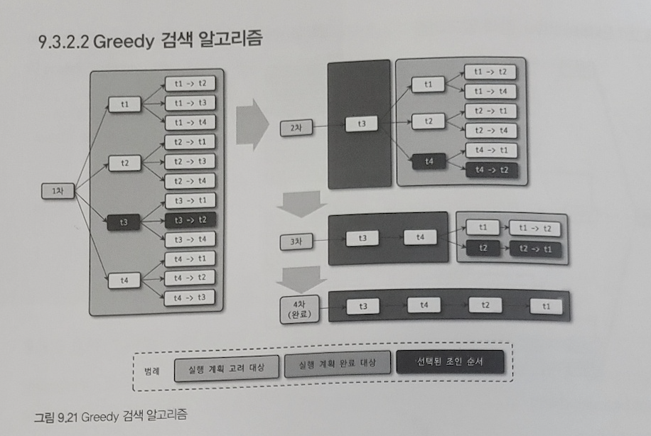

## 9장 - 옵티마이저와 힌트

---

### 9.3 고급 최적화

MySQL 서버의 옵티마이저가 실행 계획을 수립할 때는 통계 정보와 옵티마이저 옵션을 결함해 최적의 실행 계획을 수립하게 된다.

### 9.3.1 옵티마이저 스위치 옵션

옵티마이저 스위치 옵션은 `optimizer_switch` 시스템 변수를 이용해서 제어한다.

`optimizer_switch` 는 여러 개의 옵션을 세트로 묶어서 설정하는 방식을 사용한다. (책 318.p 참고)

옵티마이저 스위치 옵션은 default 와 on, off 중에서 하나를 설정할 수 있는데 default 를 설정하면 기본값이 적용된다.

스위치 옵션은 글로벌과 세션 모두 설정할 수 있다.

```sql
--// 서버 전체적으로 옵티마이저 스위치 설졍
SET GLOBAL optimizer_switch='index_merge=on,index_merge_union=on,...'
```

```sql
--// 현재 커넥션의 옵티마이저 스위치만 설정
SET SESSION optimizer_switch='index_merge=on,index_merge_union=on,...'
```

```sql
--// 옵티마이저 힌트를 이용해 현재 쿼리에만 설정
SELECT /*+ SET_VAR(optimizer_switch='condition_fanout+filter=off') */
...
FROM ...
```

---

### 9.3.1.1 MRR과 배치 키 액세스

MRR은 **Multi-Range Read** 를 줄여서 부르는 이름이다.

DS-MRR 이라고도 한다.

지금까지 지원하는 조인 방식은 **드라이빙 테이블의 레코드를 한 건 읽어서 드리븐 테이블의 일치하는 레코드를 찾아 조인을 수행하는 것이다.**

- 드라이빙 테이블 : 조인에서 제일 먼저 읽는 테이블
- 드리븐 테이블 : 드라이빙 테이블이 아닌 테이블

이런 조인 처리를 **네스티드 루프 조인** 이라고 부른다.

조인 처리는 MySQL 엔진이 실제 레코드를 검색하고 읽는 부분은 스토리지 엔진이 담당하기 때문에 **드라이빙 테이블의 레코드 건별로 드리븐 테이블의 레코드를 찾으면 스토리지 엔진에서는 아무런 최적화를 수행할 수 없다.**

이런 단점을 극복하기 위해 조인 대상 테이블 중 하나로부터 레코드를 읽어 **조인 버퍼** 에 저장한다.

조인 버퍼에 레코드가 가득차면 버퍼링된 레코드를 스토리지 엔진으로 **한 번에 요청한다.**

이러한 읽기 방식을 **MRR** 이라고 하며, 이를 응용해 실행되는 조인을 **BKA** 라고 한다.

**BKA** 조인 최적화는 쿼리 특성에 따라 큰 도움이 되는 경우도 있지만 **부가적인 정렬 작업** 이 필요해지면서 성능에 안좋은 영향을 미치는 경우도 존재해 기본적으로 **비활성화** 돼어있다.

---

### 9.3.1.2 블록 네스티드 루프 조인

조인의 연결 조건이 되는 컬림 모두 **인덱스** 가 있다면 네스티드 루프 조인 방식을 사용한다. 마치 중첩된 반복문을 사용하는 것처럼 작동해서 네스티드 루프 조인이라는 이름이 붙었다.

**블록 네스티드 루프 조인** 과 **네스티드 루프 조인** 의 차이점은 다음과 같다.

- 조인 버퍼 사용 여부
- 조인에서 트라이빙 테이블과 드리븐 테이블이 어떤 순서로 조인되느냐

조인 알고리즘에서 Block 이라는 단어가 사용되면 조인용으로 별도의 버퍼가 사용됐다는 것을 의미한다.

실행 계획에서 `Extra` 컬럼에 `Using Join Buffer` 문구가 표시되면 그 실행 계획은 조인 버퍼를 사용한다는 것을 뜻한다.

조인은 드라이빙 테이블에서 일치하는 레코드 건수만큼 드리븐 테이블을 검색하면서 처리된다.

때문에 드리븐 테이블을 검색할 때 인덱스를 사용할 수 없는 쿼리는 **상당히 느려진다.**

만약 어떤 방식으로도 드리븐 테이블의 **풀 테이블 스캔** 이나 **인덱스 풀 스캔** 을 피할 수 없다면 옵티마이저는 드라이븡 테이블에서 읽은 레코드를 메모리에 캐시한 후 드리븐 테이블과 메모리 캐시를 조인하는 형태로 처리한다.

이때의 메모리를 **조인 버퍼** 라고 하며 조인이 완료되면 바로 해제된다.

`join_buffer_size` 라는 시스템 변수를 통해 크기를 제한할 수 있다.


```sql
SELECT *
FROM dept_emp de, employees e
WHERE de.from_date > '1995-01-01' AND e.emp_no < 109004;
```

조인 버퍼를 사용하는 조인은 다음 순서로 동작한다.

1. dept_emp 테이블의 인덱스를 이용해 `de.from_date > '1995-01-01'` 조건을 만족하는 레코드 검색
2. 조인에 필요한 나머지 컬럼을 모두 `dept_emp` 테이블로부터 읽어 조인 버퍼에 저장
3. `employees` 테이블의 프라이머리 키를 이용해 `e.emp_no < 109004` 조건을 만족하는 레코드를 검색
4. 3번에서 검색된 결과에 2번의 캐시된 조인 버퍼의 레코드를 결함해서 반환

**여기서 중요한 점은 조인 버퍼가 사용되는 쿼리에서는 조인의 순서가 거꾸로인 것처럼 실행된다는 것** 이다.

실제 드라이빙 테이블의 결과는 조인 버퍼에 담아두고, 드리븐 테이블을 먼저 읽고 조인 버퍼에서 일치하는 레코드를 찾은 방식으로 처리된다.

조인 버퍼가 사용되는 조인에서는 **결과의 정렬 순서가 흐트러질 수 있다.**

---

### 9.3.1.3 인덱스 컨디션 푸시다운

MySQL 5.6 버전부터는 **인덱스 컨디션 푸시다운** 이라는 기능이 도입됐다.

**인덱스 컨디션 푸시다운** 은 너무 비효율적이어서 개선됐어야 할 기능인데, 이제서야 보완된 것이다.

```sql
SELECT *
FROM employees
WHERE last_name = 'Acton' AND first_name LIKE '%sal';
```

위의 쿼리에서 `last_name = 'Acton'` 조건에서는 인덱스 레인지 스캔을 사용할 수 있지만 `first_name LIKE '%sal'` 의 조건에서는 인덱스의 범위를 좁힐 수 없다.

그래서 `first_name LIKE '%sal'` 의 조건은 데이터를 모두 읽은 후 사용자가 원하는 결과인지 **하나씩 비교해보는 조건** 으로만 사용된다.

만약 `last_name = 'Acton'` 조건에 일치하는 레코드가 10만 건이나 되는데 단 1건만 `first_name LIKE '%sal'` 조건에 일치하면 99,999 건의 레코드 읽기가 불필요한 작업이 되어버린다.

MySQL 5.5 버전까지는 인덱스를 범위 제한 조건으로 사용하지 못한다면 MySQL 엔진이 스토리지 엔진으로 아예 전달해주지 않았다.

MySQL 5.6 버전부터는 **인덱스에 포함된 칼럼의 조건이 있다면 모두 같이 모아서 스토리지 엔진으로 전달** 할 수 있게 개선되었다.

인덱스 컨디션 푸시다운은 **쿼리의 성능이 몇 배에서 몇십 배로 향상될 수도 있는 중요한 기능** 이다.

---

### 9.3.1.4 인덱스 확장

`use_index_extensions` 옵션은 InnoDB 스토리지 엔진을 사용하는 테이블에서 세컨더리 인덱스에 자동으로 추가된 프라이머리 키를 활용할 수 있게 할지를 결정하는 옵션이다.

InnoDB 스토리지 엔진에서는 모든 세컨더리 인덱스는 리프 노드에 프라이머리 키 값을 가진다.

예전 MySQL 버전에서는 세컨더리 인덱스의 마지막에 자동 추가되는 프라이머리 키를 제대로 활용하지 못했지만 MySQL서버가 업그레이드되면서 인덱스의 마지막에 **프라이머리 키 칼럼** 이 숨어있다는 것을 인지하고 실행 계획을 수립하도록 개선됐다.

InnoDB 의 프라이머 키가 세컨더리 인덱스에 포함돼 있으므로 정렬 작업에서도 인덱스를 활용해 처리하는 장점도 있다.

---

### 9.3.1.5 인덱스 머지

인덱스를 이용해 쿼리를 실행하는 경우, 옵티마이저는 테이블별로 하나의 인덱스만 사용하도록 실행 계획을 수립한다.

인덱스 머지 실행 계획을 사용하면 **하나의 테이블에 대해 2개 이상의 인덱스를 이용해 쿼리를 처리** 한다.

하나의 인덱스만 사용해 작업 범위를 줄일 수 있다면 테이블별로 하나의 인덱스만 활용하는 것이 효울적이다.

쿼리에 사용된 각각의 조건이 서로 다른 인덱스를 사용할 수 있고 그 조건을 만족하는 레코드 건수가 **많을 것으로** 예상될 때에는 인덱스 머지 실행 계획을 선택한다.

인덱스 머지 실행 계획은 3개의 세부 실행 계획으로 나누어 볼 수 있다.

- 인덱스 머지 - 교집합(index_merge_intersection)
  - 쿼리의 WHERE문에서 어떤 조건을 사용하더라도 인덱스를 사용할 수 있을 때 사용
  - 옵티마이저는 조건으로 온 인덱스를 모두 사용해 쿼리를 처리
  - 여러 개의 인덱스를 각각 검색해서 그 결과의 **교집합** 만 반환함
  - 옵티마이저는 각각의 조건에 일치하는 레코드 건수를 예측해 각각의 조건이 상대적으로 많은 레코드를 가져온다면 **인덱스 머지** 로 실행계획을 세운다
  - `index_merge_intersection` 옵티마이저 스위치 옵션을 통해 on / off 할 수 있다.
- 인덱스 머지 - 합집합(index_merge_union)
  - `WHERE` 절에 2개 이상의 조건이 각각의 인덱스를 사용하되 `OR` 연산자로 연결된 경우 사용되는 최적화
  - 각각의 인덱스 검색 결과를 `Union` 알고리즘으로 병합한다.
  - 각각의 결과가 **프라이머리 키로 정렬** 돼어있어 각 집합에서 하나씩 가져와 서료 비교하며 중복된 레코드들을 정렬 없이 걸러낼 수 있다.
  - 이때 사용되는 알고리즘을 우선순위 큐라고 한다.
- 인덱스 머지 - 정렬 후 합집합(index_merge_sort_union)
  - 인덱스 머지 작업 도중 결과의 정렬이 필요한 경우 사용된다.
  - 각 검색 결과 집합에서 중복을 제거하기 위해 프라이머리 컬럼으로 정렬한 다음 중복 제거를 수행한다.

---

### 9.3.1.9 세미 조인

다른 테이블과 실제 조인을 수행하지 않고, 다른 테이블에서 조건에 일치하는 레코드가 있는지 없는지만 체크하는 형태의 쿼리를 **세미 조인** 이라고 한다.

```sql
SELECT *
FROM employees e
WHERE e.emp_no IN
(SELECT de.emp_no FROM dept_emp de WHERE de.from_date='1995-01-01');
```

세미 조인 최적화 기능이 없었을 때에는 위의 쿼리에서 테이블을 풀 스캔하면서 한 건 한 건 서브쿼리의 조건에 일치하는지 비교했다.

세미 조인 형태의 쿼리와 안티 세미 조인 형태의 쿼리는 **최적화 방법이 조금 차이가 있다.**

`=(subquery)` 형태와 `IN (subquery)` 형태의 세미 조인 쿼리에 대해 다음과 같은 3가지 최적화 방법을 적용할 수 있다.

- 세미 조인 최적화
- IN-to-EXISTS 최적화
- MATERIALIZATION 최적화

`<>(subquery)` 형태와 `NOT IN (subquery)` 형태의 안티 세미 조인 쿼리에 대해서 다음 2가지의 최적화 방법이 있다.

- IN-to-EXISTS 최적화
- MATERIALIZATION 최적화

MySQL 서버 8.0 부터는 세미 조인 쿼리의 성능을 개선하기 위해 다음과 같은 최적화 전략이 있다.

- Table Pull-out
- Duplicate Weed-out
- First Match
- Loose Scan
- Materialization

이 중 `Table Pull-out` 전략을 사용하면 항상 세미 조인보다 좋은 성능을 내기 때문에 별도의 제어 옵션을 제공하지 않는다.

---

### 9.3.1.10 테이블 풀 - 아웃

`Table Pull-out` 최적화는 세미 조인의 서브쿼리에 사용된 테이블을 **아우터 쿼리** 로 끄집어낸 후 쿼리를 조인 쿼리로 재작성하는 형태의 최적화다.

`Table Pull-out` 최적화의 몇 가지 제한 사항과 특성은 다음과 같다.

- 세미 조인 서브쿼리에서만 사용 가능하다.
- 서브쿼리 부분이 `UNIQUE` 인덱스나 프라이머리 키 룩업으로 결과가 1건인 경우에만 사용 가능하다.
- `Table Pull-out` 이 적용되어도 기존 쿼리에서 가능했던 최적화 방법이 사용 불가능한 것은 아니므로 `MySQL` 에서는 가능하다면 `Table Pull-out` 최적화를 최대한 적용한다.
- 서브쿼리의 테이블을 아우터 쿼리로 가져와서 조인으로 풀어쓰는데 서브쿼리의 모든 테이블이 아우터 쿼리로 끄집어 낼 수 있다면 서브쿼리 자체는 없어진다.

---

### 9.3.1.11 퍼스트 매치

`First Match` 전략은 `IN` 형태의 세미 조인을 `EXISTS(subquery)` 형태로 튜닝한 것과 비슷한 방법으로 실행된다.

`First Match` 는 서브쿼리를 조인으로 풀어서 실행하며 일치하는 첫 번째 레코드만 검색하는 최적화이다.


`First Match` 최적화는 MySQL 5.5 에서 수행했던 `IN-to-EXISTS` 변환과 거의 비슷한 처리 로직을 수행한다.

`First Match` 은 다음과 같은 장점이 있다.

- 가끔 여러 테이블이 조인되는 경우 원래 쿼리에는 없던 동등 조건을 옵티마이저가 자동으로 추가하는 형태의 최적화가 실행되기도 한다.
- 서브쿼리의 모든 테이블에 대해 최적화를 수행할지 아니면 일부 테이블에 대해서만 수행할지 취사선택할 수 있다.

`First Match` 최적화의 몇가지 제한 사항과 특징은 다음과 같다.

- 서브쿼리는 그 서브쿼리가 참조하는 모든 아우터 테이블이 먼저 조회된 이후에 실행된다.
- 실행 계획의 `Extra` 칼럼에는 `First Match(table-N)` 문구가 표시된다.
- 상관 서브쿼리에서도 사용될 수 있다.
- `GROUP BY` 나 집합 함수가 사용된 서브쿼리의 최적화에는 사용할 수 없다.

---

### 9.3.1.12 루스 스캔

루스 스캔은 루스 인덱스 스캔과 비슷한 읽기 방식을 사용한다.


루스 스캔은 다음과 같은 특성을 가진다.

- 루스 인덱스 스캔으로 서브쿼리 테이블을 읽고, 그 다음으로 아우터 테이블을 드리븐으로 사용해서 조인을 수행한다.
- 서브쿼리 부분이 루스 인덱스 스캔을 사용할 수 있는 조건이 갖춰줘야 사용할 수 있다.

---

### 9.3.1.13 구체화

세미 조인에 사용된 서브쿼리를 통째로 구체화해서 쿼리를 최적화한다는 의미이다.

여기서 **구체화** 는 내부 임시 테이블을 생성한다는 것을 의미한다.

구체화 최적화는 서브쿼리가 먼저 실행되고 그 결과를 임시 테이블로 만든다. 그리고 최종적으로 구체화된 임시 테이블과 검색 테이블을 조인해서 결과를 반환한다.

구체화 체적화는 **서브쿼리 내에** `GROUP BY` 절이 있어도 사용할 수 있다.

`Materialization` 최적화는 다음과 같은 특성을 가진다.

- `IN (subquery)` 에서 서브쿼리는 상관 서브쿼리가 아니어야 한다.
- 서브쿼리는 `GROUP BY` 나 집합 함수들이 사용돼도 구체화를 사용할 수 있다.
- 구체화가 사용되는 경우에는 내부 임시 테이블이 사용된다.

---

### 9.3.1.14 중복제거

`Duplicate Weed-out` 최적화는 세미 조인 서브쿼리를 일반적인 `INNER JOIN` 쿼리로 바꿔서 실행하고 마지막에 중복된 레코드를 제거하는 방법으로 처리되는 최적화 알고리즘이다.

`Duplicate Weed-out` 최적화는 `INNER JOIN` + `GROUP BY` 절로 바꿔서 실행하는 것과 동일한 작업으로 쿼리를 실행한다.

```sql
SELECT *
FROM employees e
WHERE e.emp_no IN (SELECT s.emp_no FROM saleries s WHERE s.salary > 150000)
```


위의 사진에서 쿼리의 실행 순서는 다음과 같다.

1. `saleries` 테이블의 인덱스를 스캔해 `salary > 150000` 조건을 만족시키는 레코드를 검색해 `employees` 테이블 조인을 실횅한다.
2. 조인된 결과를 임시 테이블에 저장.
3. 임시 테이블에 저장된 결과에서 `emp_no` 기준으로 중복 제거
4. 중복을 제거하고 남은 레코드를 최종적으로 반환

위의 과정에서 1번과 2번의 과정은 **반복적** 으로 실행되는 과정이다.

`Duplicate Weed-out` 최적화의 몇가지 제한 사항과 특징은 다음과 같다.

- 서브쿼리가 상관 서브쿼리라고해도 사용할 수 있다.
- 서브쿼리가 `GROUP BY` 나 집합 함수가 사용된 경우에는 사용할 수 없다.
- 서브쿼리의 테이블을 조인으로 처리하기 때문에 최적화할 수 있는 방법이 많다.

---

### 9.3.1.15 컨디션 팬아웃

조인을 실행할 때 테이블의 순서는 **쿼리의 성능에 큰 영향을 미친다.**

조건에 일치하는 레코드가 많은 테이블이 드라이빙 테이블로 결정되면 다른 테이블은 드라이빙 테이블의 레코드만큼 값을 읽어야한다.

MySQL 옵티마이저는 여러 테이블이 조인되는 경우 가능하다면 일치하는 레코드 건수가 **적은** 순서대로 조인을 실행한다.

`condition_fanout_filter` 옵션이 활성화 되어있으면 옵티마이저는 인덱스를 사용할 수 있는 조건 외에 나머지 조건에 대해서도 얼마나 조건을 충족할지를 고려하게된다.

`condition_fanout_filter` 옵션이 활성화 되어있으면 다음과 같은 조건을 만족하는 칼럼의 조건들에 대해 레코드의 비율을 계산할 수 있다.

- `WHERE` 조건절에 사용된 칼럼에 대해 인덱스가 있는 경우
- `WHERE` 조건절에 사용된 칼럼에 대해 히스토그램이 존재하는 경우

MySQL 옵티마이저가 실행 계획을 수립할 때 테이블이나 인덱스의 통계 정보만 사용하는 것이 아닌 다음의 순서대로 사용 가능한 방식을 선택한다.

1. 레인지 옵티마이저를 이용한 예측
2. 히스토그램을 이용한 예측
3. 인덱스 통계를 이용한 예측
4. 추측에 기반한 예측

레인지 옵티마이저는 **실제 인덱스를 살펴보고 레코드 건수를 예측하는 방식** 이다. 실제 쿼리가 **실행되기도 전** 에 실행 계획 수립 단계에서 빠르게 소량의 데이터를 읽어보는 것이다.

`condition_fanout_filter` 옵션이 활성화 되어있으면 MySQL 옵티마이저는 더 정교한 계산을 거쳐 실행 계획을 수립한다. 이에따라 실행 계획 수립에 많은 자원을 사용하게 되는데 쿼리가 간단하고 MySQL 8.0 이전 버전에서도 쿼리 실행 계획이 잘못된 선택을 한 적이 별로 없다면, 성능 향상에 크게 도움이 되지 않을수도 있다.

가능하면 업그레이드 전에 성능 테스트를 진행하는 것이 좋다.

---

### 9.3.1.15 파생 테이블 머지

예전 버전의 MySQL 서버는 `FROM` 절에 사용된 서브쿼리는 먼저 실행해서 결과를 **임시 테이블** 로 만든 다음 외부 쿼리 부분을 처리했다.

MySQL 서버에서는 `FROM` 절에 사용된 서브쿼리를 **파생 테이블** 이라고 부른다.

내부적으로 임시 테이블을 생성하고 레코드를 읽어 임시 테이블로 `INSERT` 한 뒤 다시 임시 테이블을 읽으므로 **레코드를 복사하고 읽는** 오버헤드가 더 추가된다.

임시 테이블은 처음에는 메모리에 생성되지만 저장될 레코드 건수가 많아지면 디스크로 다시 기록돼야한다. 따라서 레코드가 많아진다면 임시 테이블로 레코드를 복사하고 읽는 오버헤드로 인해 쿼리의 성능은 떨어지게된다.

예전 버전에서는 메모리에 생성되는 임시테이블은 `MEMORY 스토리지 엔진` 을 사용했으며, 디스크에 생성되는 임시 테이블은 `MyISAM` 스토리지 엔진을 사용했다.

- `MEMORY 스토리지 엔진` 은 가변 길이 칼럼을 지원하지 않아 메모리를 과다하게 사용하는 단점이 있다.
- `MyISAM 스토리지 엔진` 은 트랜잭션을 지원하지 않는 단점이 있다.

이러한 단점을 보완하기 위해 MySQL 8.0 부터는 메모리에 생성되는 임시 테이블은 `TempTable 스토리지  엔진` 이 도입됐고 디스크 임시 테이블에는 `InnoDB 스토리지 엔진` 을 사용하도록 개선됐다.

- `TempTable 스토리지  엔진` 은 가변 길이 칼럼을 지원함
- `InnoDB 스토리지 엔진` 은 트랜잭션을 지원함, `MyISAM 스토리지 엔진` 보다 성능이 좋음.

MySQL 5.7 버전부터 파생 테이블로 만들어지는 서브쿼리를 외부 쿼리와 병합해 서브쿼리 부분을 제거하는 `파생 테이블 머지` 최적화가 도입돼었다.

다음과 같은 경우에는 옵티마이저가 자동으로 서브쿼리를 외부 쿼리로 병합할 수 없게되므로 다음의 경우에 해당한다면 수동으로 외부 쿼리로 병합해 작성하는 것이 쿼리 성능 향상에 도움이 된다.

- `SUM()`, `MIN()` 같은 집계 함수와 윈도우 함수가 사용된 서브쿼리
- `DISTINCT` 가 사용된 서브쿼리
- `GROUP BY` 나 `HAVING` 이 사용된 서브쿼리
- `LIMIT` 이 사용된 서브쿼리
- `UNION`, `UNION ALL` 을 포함하는 서브쿼리
- `SELECT` 절에 사용된 서브쿼리
- 값이 변경되는 사용자 변수가 사용된 서브쿼리

---

### 9.3.1.17 인비저블 인덱스

MySQL 8.0 버전부터는 인덱스의 가용 상태를 제어할 수 있는 기능이 추가됐다.

MySQL 8.0 이전 버전까지는 인덱스가 존재하면 항상 옵티마이저가 실행 계획을 수립할 때 **해당 인덱스를 검토하고 사용** 했다.

MySQL 8.0 버전부터 인덱스를 삭제하지 않고, 해당 인덱스를 사용하지 못하게 제어하는 기능을 제공한다.

```sql
--// 옵티마이저가 ix_hiredate 인덱스를 사용하지 못하게 변경
ALTER TABLE employees ALTER INDEX ix_hiredate INVISIBLE;

--// 옵티마이저가 ix_hiredate 인덱스를 사용할 수 있게 변경
ALTER TABLE employees ALTER INDEX ix_hiredate VISIBLE;
```

위의 인비저블 인덱스는 `use_invisible_indexes` 옵션이 활성화 돼어있는 상태여야 동작이 가능하다.

---

### 9.3.1.18 스킵 스캔

인덱스의 핵심은 **값이 정렬** 돼 있다는 것이며, 이로 인해 인덱스를 구성하는 칼럼의 순서가 매우 중요하다.

(a, b, c) 칼럼으로 구성된 인덱스가 있을 때 쿼리의 `WHERE` 절에 b 와 c 칼럼에 대한 조건을 가지고 있다면 이 쿼리는 **인덱스를 활용할 수 없다.**

인덱스 스킵은 제한적이긴 하지만 인덱스의 이런 제약 사항을 뛰어넘을 수 있는 최적화 기법이다.

MySQL 8.0 버전부터 도입된 인덱스 스킵은 **인덱스의 선행 칼럼이 조건절에 사용되지 않더라도** 후행 칼럼의 조건만으로도 인덱스를 이용한 쿼리 성능 개선이 가능하게 만들어준다.

이때 인덱스 선행 칼럼이 매우 다양한 값을 가지는 경우에는 인덱스 스킵 스캔 최적화가 비효율적일 수 있다.

MySQL 8.0 옵티마이저는 인덱스의 선행 칼럼이소수의 유니크한 값을 가질때만 인덱스 스킵 스캔 최적화를 사용한다.

`skip_scan` 옵션을 통해 활성화, 비활성화를 할 수 있으며 힌트를 사용해 특정 테이블에 대해 스킵 스캔을 사용하도록 만들 수 있다.

---

### 9.3.1.19 해시 조인

MySQL 8.0.18 버전부터는 **해시 조인** 이 추가로 지원됐다.

- 해시조인은 첫 번째 레코드를 찾는데 시간이 많이 걸리지만 최종 레코드를 찾는 데까지는 시간이 많이 걸리지 않는다.
- 네스티드 루프 조인은 마지막 레코드를 찾는 데까지는 시간이 많이 걸리지만 첫 번째 레코드를 찾는 것은 상대적으로 빠르다.

**해시 조인은 최고 스루풋** 에 적합하며 **네스티드 루프 조인은 최고 응답 속도** 전략에 적합하다.

일반적인 웹 서비스는 **온라인 트랜잭션 서비스** 이기 때문에 응답 속도가 더 중요하다.

반면에 분석과 같은 서비스는 **사용자의 응답 시간보다 전체 스루풋이 중요하다.**

MySQL 서버는 범용 RDBMS이며 범용은 **온라인 트랜잭션 처리** 를 위한 데이터 베이스 서버를 지칭하는 것이다.

때문에 MySQL 서버는 응답 속도에 집중해서 최적화를 하게된다. 주로 조인 조건의 칼럼이 인덱스가 없거나 조인 대상 테이블 중 일부의 레코드 건수가 매우 적은 경우 등에 대해서만 **해시 조인** 을 사용하도록 설계되어있다.

MySQL 서버의 해시 조인은 네스티드 루프 조인이 적합하지 않은 경우를 위한 **차선책** 으로 생각하는 것이 좋고, 강제로 쿼리의 실행 계획을 해시 조인으로 유도하는 것은 좋지 않다.

MySQL 8.0.20 버전부터는 **블록 네스티드 루프 조인** 은 더이상 사용되지 않고, 네스티드 루프 조인을 사용할 수 없는 경우에는 항상 **해시 조인** 이 사용되도록 바뀌었다.

일반적으로 해시 조인은 **빌드 단계** 와 **프로브 단계** 로 나뉘어 처리된다.

빌드 단계에서는 조인 대상 테이블 중 레코드 건수가 적어서 해시 테이블로 만들기에 용이한 테이블을 골라 메모리에 해시 테이블을 생성(빌드) 하는 작업을 수행한다.

- 빌드 단계에서 해시 테이블을 만들 때 사용되는 테이블을 빌드 테이블이라고 한다.

프로브 단계는 나머지 테이블의 레코드를 읽어 해시 테이블의 일치 레코드를 찾는 과정을 의미한다.

- 이 때 나머지 테이블을 프로브 테이블이라고 한다.


위의 사진과 같이 빌드 테이블의 레코드를 읽어 메모리에 해시 테이블을 생성하고, 프로브 테이블을 스캔하면서 메모리에 생성된 해시 테이블에서 레코드를 찾아 결과를 사용자에게 반환한다.

해시 테이블을 메모리에 저장할 때 `join_buffer_size` 변수로 크기를 제어할 수 있는 **조인 버퍼** 를 사용한다.

조인 버퍼의 기본 크기는 `256KB` 인데 조인 버퍼의 공간이 부족한 경우 MySQL 서버는 빌드 테이블과 프로브 테이블을 적당한 크기의 **청크** 로 분리한 다음 청크 별로 해시 조인을 처리한다.


위는 조인 버퍼보다 해시 테이블이 큰 경우 해시 조인이 실행되는 과정을 나타낸 그림이다.

해시 조인 처리 방법이 복잡해진 이유는 만들어질 해시 테이블이 설정된 메모리 크기보다 큰지 알 수 없기 때문이다.

MySQL 서버는 메모리의 해시 테이블을 준비하다가 지정된 메모리 크기를 넘어서면 나머지 레코드를 디스크에 청크로 구분해 저장한다.

**빌드 테이블 청크** 와 **프로브 테이블 청크** 2개의 공간이 생긴다.


1차 조인이 완료되면 위의 그림과 같이 MySQL 서버는 디스크에 저장된 **빌드 테이블 청크** 에서 첫 번째 청크를 읽어서 다시 **메모리 해시 테이블** 을 구축한다.

그 뒤 **프로브 테이블 청크** 에서 첫 번째 청크를 읽으며 새로 구축된 **메모리 해시 테이블** 과 조인을 수행해 2차 결과를 가져온다.

이 과정은 디스크에 저장된 청크의 갯수만큼 반복 처리해 완성된 조인 결과를 만들어낸다. 이렇게 청크 단위로 수행하기 위해 MySQL 서버는 2차 해시 함수를 이용해 **빌드 테이블** 과 **프로브 테이블** 을 동일 개수의 청크로 쪼개어 디스크로 저장한다.

MySQL 옵티마이저는 빌드 테이블의 크기에 따라 메모리에서 모두 처리 가능한 경우에는 **클래식 해시 조인** 알고리즘을 사용하고 해시 테이블이 조인 버퍼 메모리보다 큰 경우에는 **그레이스 해시 조인** 알고리즘을 하이브리드하게 활용하도록 구현돼 있다.

MySQL 서버의 해시 조인에서 해시 키를 만들 때 `xxHash64` 해시 함수를 사용하는데 매우 빠르고 해시된 값의 분포도도 훌륭한 해시 알고리즘이다.

---

### 9.3.1.20 인덱스 정렬 선호

MySQL 옵티마이저는 `ORDER BY` 또는 `GROUP BY` 를 인덱스를 사용해 처리 가능한 경우 쿼리의 실행 계획에서 이 인덱스의 가중치를 높이 설정해 실행한다.

그런데 가끔 MySQL 옵티마이저가 잘못된 실행 계획을 선택하는 경우가 있을 수 있다.

MySQL 8.0.20 버전까지는 옵티마이저의 실수가 자주 발생하면 다른 실행 계획을 사용하게 하기 위해 특정 인덱스(ORDER BY를 위한 인덱스) 를 사용하지 못하도록 `IGNORE INDEX` 힌트를 사용했다.

MySQL 8.0.21 버전부터는 옵티마이저가 **ORDER BY를 위한 인덱스** 에 너무 가중치를 부여하지 않도록
`prefer_odering_index` 옵티마이저 옵션이 추가됐다.

`prefer_odering_index` 옵션은 기본값으로 `ON` 으로 설정돼 있지만 옵티마이저가 자주 실수한다면 `OFF` 로 변경하면 된다.

---

### 9.3.2 조인 최적화 알고리즘

MySQL 에는 조인 쿼리의 실행 계획 최적화를 위한 알고리즘이 2개 있다. 5.0 버전부터 있던 기능인데 테이블의 개수가 많아지면 최적화된 실행 계획을 찾는 것이 어려워지고 실행 계획을 수립하는 데만 몇 분이 걸릴 수도 있다.

테이블의 개수가 특정 한계를 넘어서면 그때부터는 실행 계획 수립에 몇 시간이나 며칠이 걸릴수도 있다.

### 9.3.2.1 Exhaustive 검색 알고리즘


`Exhaustive 검색 알고리즘` 은 MySQL 5.0과 그 이전 버전에서 사용되던 조인 최적화 기법이다.

`FROM` 절에 명시된 모든 테이블의 조합에 대해 실행 계획의 비용을 계산해서 최적의 조합 1개를 찾는 방법이다.

이 방법은 테이블이 20개라면 처리 가능한 조합은 `20!` 개가 되기 때문에 테이블이 10개만 넘어도 실행 계획을 수립하는 데 몇 분이 걸린다. 또한 테이블이 10개에서 1개만 더 늘어나도 11배의 시간이 더 걸린다.

---

### 9.3.2.2 Greedy 검색 알고리즘



Greedy 검색 알고리즘은 MySQL 5.0부터 도입된 조인 최적화 기법이다.

Greedy 검색 알고리즘은 다음과 같은 순서로 조인 순서를 결정한다.

1. 전체 N 개의 테이블 중에서 `optimizer_search_depth` 시스템 설정 변수에 정의된 개수의 테이블로 가능한 조인 조합을 생성
2. 1번에서 생성된 조인 조합 중 최소 비용의 실행 계획 하나를 선정
3. 2번에서 선정된 실행 계획의 첫 테이블을 **부분 실행 계획** 의 첫 번째 테이블로 선정
4. 전체 N-1개의 테이블 중(3번에서 선택된 테이블 제외) 에서 `optimizer_search_depth` 시스템 설정 변수에 정의된 개수의 테이블로 가능한 조인 조합을 생성
5. 4번에서 생성된 조인 조합들을 하나씩 3번에서 생성된 **부분 실행 계획** 에 대입해 실행 비용을 계산
6. 5번의 비용 계산 결과, 최적의 실행 계획에서 두 번째 테이블을 3번에서 생성된 **부분 실행 계획** 의 두번 째 테이블로 선정
7. 남은 테이블이 모두 없어질 때까지 4 ~ 6번까지의 과정을 반복 실행하면서 **부분 실행 계획** 에 테이블의 조인 순서를 기록
8. 최종적으로 **부분 실행 계획** 이 테이블의 조인 순서를 결정됨

Greedy 검색 알고리즘의 `optimizer_search_depth` 시스템 변수의 기본값은 `62` 다.

MySQL 에서 조인 최적화를 위한 시스템 변수로 `optimizer_prune_level` 과 `optimizer_search_depth` 가 제공된다.

- optimizer_search_depth: Greedy 검색 알고리즘과 Exhaustive 검색 알고리즘 중에서 어떤 알고리즘을 사용할지 결정하는 변수다.

  - 0 ~ 62 까지의 정숫값을 설정할 수 있다.
  - 1 ~ 62 까지의 정숫값이 설정되면 Greedy 검색 대상을 지정된 개수로 한정해서 최적의 실행 계획을 산출한다.
  - 0으로 설정되면 최적의 조인 검색 테이블의 개수를 MySQL 옵티마이저가 자동으로 결정한다.
  - `optimizer_prune_level` 이 0으로 설정된 경우에는 `optimizer_search_depth` 의 값을 4 ~ 5 정도로 설정하는 것이 좋다.

- optimizer_prune_level: MySQL 5.0부터 추가된 휴리스틱 검색 작동 방식 제어 변수다.
  - 검색 알고리즘 중 어떤 알고리즘을 사용하더라도 MySQL 옵티마이저는 여러 테이블의 조인 순서를 결정하기 위해 상당히 많은 조인 경로를 비교한다.
  - 휴리스틱 검색의 핵심은 조인 순서의 비용을 계산하는 도중 이미 계산했던 조인 순서의 비용보다 큰 경우에는 언제든지 중간에 포기할 수 있다는 것이다.
  - 1로 설정되면 조인 순서 최적화에 경험 기반의 휴리스틱 알고리즘을 사용한다.
  - 0으로 설정되면 경험 기반의 휴리스틱 최적화가 적용되지 않는다.
  - 특별한 요건이 없다면 0으로는 설정하지 말자.
